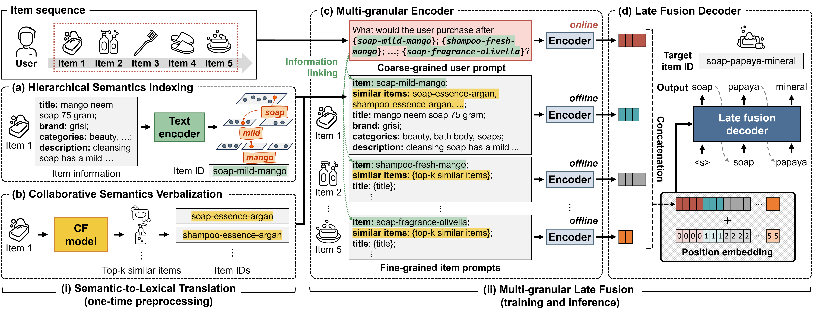

# GRAM: Generative Recommendation via Semantic-aware Multi-granular Late Fusion (ACL'25)

[](https://aclanthology.org/2025.acl-long.1596/)
[](https://arxiv.org/abs/2506.01673)
[](https://www.python.org/downloads/release/python-390/)
[](https://pytorch.org/)

This is the official implementation for the **ACL 2025** paper: "*GRAM: Generative Recommendation via Semantic-aware Multi-granular Late Fusion*".

## 🔍 Overview

**GRAM** (Generative Recommender via semantic-Aware Multi-granular late fusion) is a novel generative recommendation system that effectively translates item relationships into LLM's vocabulary space and efficiently processes rich metadata through multi-granular late fusion.

<div align="center">
  
</div>


### 📖 Resources
- 📄 **Paper**: [ACL Anthology](https://aclanthology.org/2025.acl-long.1596/) | [arXiv](https://arxiv.org/abs/2506.01673)
- 🎨 **Presentation**: [Poster](assets/gram_poster.pdf) | [Slides](assets/gram_slide.pdf)
- 📝 **Blog Post**: [Korean](https://dial.skku.edu/blog/2025_gram)

## 🛠️ Environment Setup

### Requirements
- **Python**: 3.9+
- **PyTorch**: 1.11.0
- **Transformers**: 4.26.0
- **CUDA**: 11.3

### Installation

1. **Clone the repository**
```bash
git clone https://github.com/skleee/GRAM.git
cd GRAM
```

2. **Create conda environment**
```bash
conda create -n gram python=3.9
conda activate gram
```

3. **Install dependencies**
```bash
# Install general dependencies
pip install -r requirements.txt

# Install PyTorch with CUDA support
pip install torch==1.11.0+cu113 torchvision==0.12.0+cu113 torchaudio==0.11.0 \
    --extra-index-url https://download.pytorch.org/whl/cu113
```

## 📊 Datasets

We evaluate GRAM on **4 datasets** from two domains:

### Amazon Review Datasets
- Product reviews from Amazon with rich metadata  
  - **Beauty**: Cosmetics and personal care products  
  - **Toys**: Children's toys and gaming products  
  - **Sports**: Sports equipment and outdoor gear

### Yelp Dataset
- **Yelp**: Local business reviews and ratings

### Data Sources
- **Amazon Review**: [Official Dataset](https://jmcauley.ucsd.edu/data/amazon/)
- **Yelp**: [Official Dataset](https://business.yelp.com/data/resources/open-dataset/)
- **Preprocessed Data**: Available in `rec_datasets/` directory
For more details on the dataset structure, please refer to [README.md](rec_datasets/README.md) in the `rec_datasets/` directory.


## 🚀 Training and Inference

Execute the training scripts located in the `command/` folder:

```bash
# Amazon Beauty dataset
bash train_gram_beauty.sh

# Amazon Toys dataset  
bash train_gram_toys.sh

# Amazon Sports dataset
bash train_gram_sports.sh

# Yelp dataset
bash train_gram_yelp.sh
```
> **Note**: Semantic-to-lexical translation preprocessing scripts will be released soon.

## 🙏 Acknowledgments

This work builds upon several open-source projects:
- [**IDGenRec**](https://github.com/agiresearch/IDGenRec): Generative recommendation framework
- [**OpenP5**](https://github.com/agiresearch/OpenP5): Open-source P5 implementation  
- [**FiD**](https://github.com/facebookresearch/FiD): Fusion-in-Decoder architecture

We sincerely thank the authors for sharing their valuable implementations.


## 📜 Citation

If you find this work helpful, please consider citing our paper:

```bibtex
@inproceedings{lee2025gram,
  title     = {{GRAM}: Generative Recommendation via Semantic-aware Multi-granular Late Fusion},
  author    = {Sunkyung Lee and Minjin Choi and Eunseong Choi and Hye-young Kim and Jongwuk Lee},
  booktitle = {Proceedings of the 63rd Annual Meeting of the Association for Computational Linguistics (ACL)},
  pages     = {33294--33312},
  year      = {2025},
  url       = {https://aclanthology.org/2025.acl-long.1596/}
}
```
